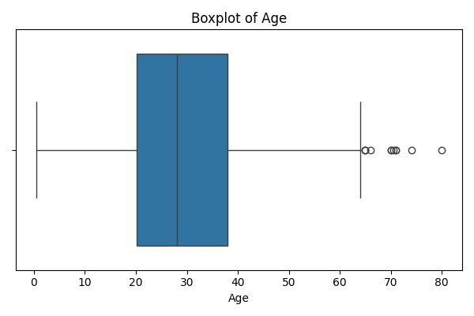
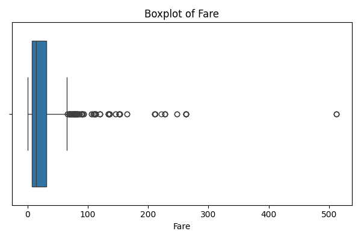
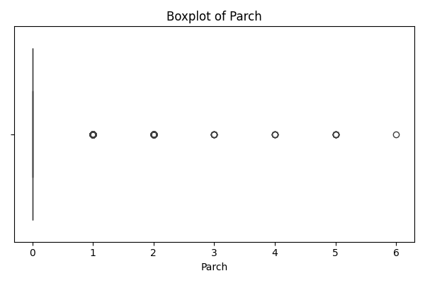
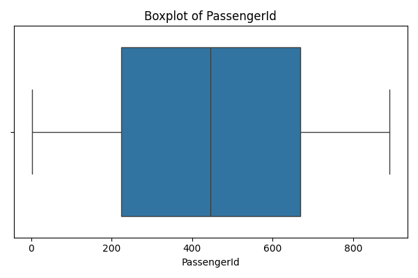
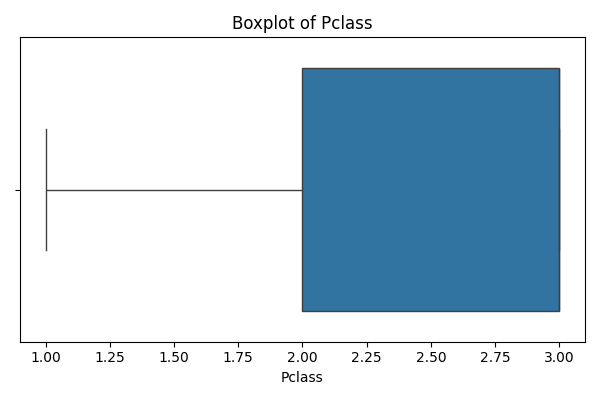
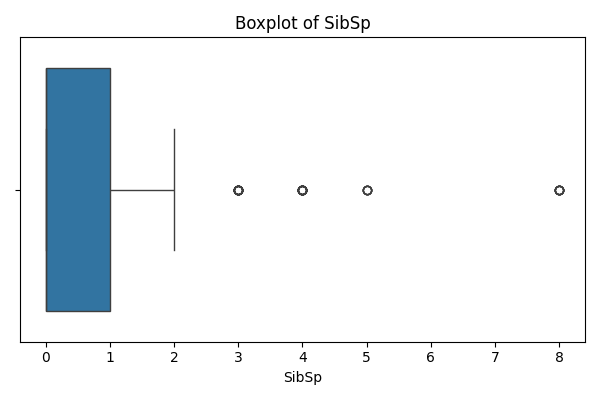
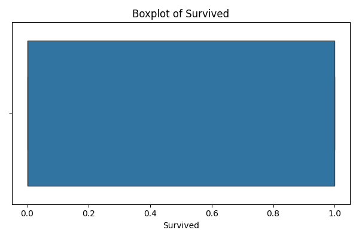
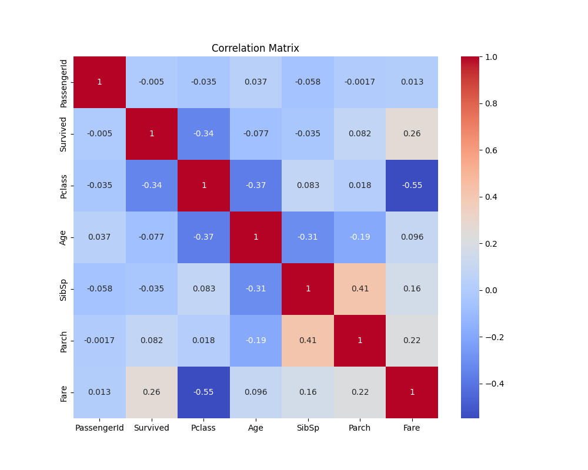

# 🚢 Titanic Dataset – Exploratory Data Analysis (EDA)

## 📌 Project Overview

This project performs Exploratory Data Analysis (EDA) on the Titanic dataset to understand:

1. Data distribution

2. Feature relationships

3. Outliers

4. Survival patterns

5. Data quality issues

---

## 📂 Dataset Information

- Source: Kaggle Titanic Dataset  
- Rows: 891  
- Target Variable: `Survived`  
- Problem Type: Binary Classification

---

## 📌 Tools Used:

Python

Pandas

Matplotlib

Seaborn

Plotly

---

## 📊  Dataset Overview

Target Variable: Survived

Total Features: Passenger demographics, ticket information, family size, fare, etc.

Objective: Identify patterns affecting survival.

---

## 📈 Visual Analysis & Insights

## 1️⃣ Age Distribution

### 🔎 Insights:

Majority of passengers aged between 20–40 years.

Slight right skew.

Few elderly outliers (65+).

Age alone is not a strong survival predictor.

---

## 2️⃣ Fare Distribution

### 🔎 Insights:

Highly right-skewed distribution.

Most fares below 50.

Extreme high-value outliers (100–500+).

Outliers represent first-class passengers.

Log transformation recommended for modeling.

---

## 3️⃣ Parch (Parents/Children Aboard)

### 🔎 Insights:

Most passengers traveled without parents/children.

Few large family outliers.

Feature may help in family survival analysis.

---

## 4️⃣ PassengerId

### 🔎 Insights:

Uniform distribution.

Pure identifier.

Not useful for modeling.

Should be removed.

---

## 5️⃣ Passenger Class (Pclass)

### 🔎 Insights:

Majority passengers were in 3rd class.

Strong relationship between class and survival.

Higher class → better survival probability.

---

## 6️⃣ SibSp (Siblings/Spouse Aboard)

### 🔎 Insights:

Most passengers traveled alone.

Some large family groups exist.

Family size may influence survival.

---

## 7️⃣ Survival Distribution

### 🔎 Insights:

Binary target variable.

Better visualized using countplot.

Class imbalance present.

---

## 🔥 Correlation Analysis

### 🔎 Key Findings:

Fare positively correlated with survival.

Pclass negatively correlated with survival.

No severe multicollinearity detected.

---

## 📌 Key Business-Level Insights

Gender and Passenger Class strongly influence survival.

Fare is highly skewed and contains extreme values.

Most passengers traveled alone.

Data requires preprocessing before modeling (handling missing values & skewness).

---

## 🛠 Data Preprocessing Recommendations

Impute missing Age values.

Drop PassengerId.

Handle Cabin (high missing ratio).

Apply log transformation on Fare.

Encode categorical variables.

---

## 🎯 Conclusion

EDA successfully identified:

Survival-driving factors

Outlier presence

Skewness in numeric features

Feature importance direction

Dataset is ready for feature engineering and model development.
